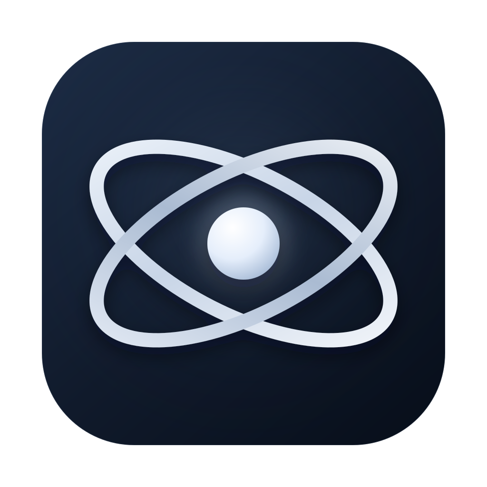

<div align="center">
  
  <h1>Orbit</h1>
  <p>A desktop interface for working with coding agents, project files, diffs, and terminals.</p>
</div>

Orbit keeps the agent, repository, diffs, and terminal in one native
workspace. Ask for a change, follow the steps as they happen, inspect the files
touched, and continue working without switching between several applications.

## Features

- **See the work, not just the answer.** Streamed reasoning summaries, tool
  calls, subagents, todos, and permission requests stay visible in one timeline.
- **Review changes where they happen.** A live Changes list and Monaco-powered
  Edit/Diff views make every file modification easy to inspect.
- **Run agents side by side.** Agent Mode collapses the sidebar and turns the
  workspace into resizable, concurrent session panels.
- **Use the native agent TUI.** Open an agent panel's GUI/TUI mode menu to run
  the installed OpenCode terminal interface directly inside that panel.
- **Keep a real development environment.** Browse files, edit with autosave,
  use Emmet, validate HTML and CSS, and open the integrated terminal.
- **Stay in control.** Choose agents and models per workspace, attach files,
  reference project context with `@`, and stop or redirect work at any time.
- **Choose the runtime.** OpenCode and DeepSeek Harness sessions share the same
  local workspace, editor, diff, terminal, and session surface.

## Workflow

The interface is deliberately direct: Sessions and files on the left, the
editor in the center, and the active agent on the right. Open the terminal when
you need it, expand Agent Mode when you want parallel work, or collapse panels
to keep the code in focus.

1. Open a repository or individual file.
2. Pick an agent and model, then describe what you want to build.
3. Watch the plan, tools, and file changes arrive live.
4. Review the diff, edit directly, validate, and continue the conversation.

## Core Capabilities

| Workspace | Agent | Review |
|---|---|---|
| File explorer and project sessions | Streaming turns and structured steps | Live Changes and per-file diffs |
| Monaco editor with tabs and autosave | Multiple models and concurrent panels | Permission requests and recovery flows |
| Integrated PTY terminal | Prompt queue, attachments, and `@` context | W3C HTML/CSS validation |

Orbit is an Electron, React, and Monaco application with a versioned runtime
adapter boundary. It supports [`opencode`](https://opencode.ai/v2) and the
DeepSeek Harness `dsh` CLI; each adapter declares its capabilities so the UI
does not offer unsupported controls. The Electron main process owns all runtime
and filesystem access; the renderer receives a narrow preload API and normalized
live events.

## Get Started

### Requirements

- Node 22.23.2 or later within the Node 22 release line
- [`opencode`](https://opencode.ai/v2) on your `PATH`, or an OpenCode service
  already running, and/or `dsh` for DeepSeek Harness sessions
- macOS for the most complete and validated experience

### Run From Source

```sh
npm install
npm run dev
```

Clone this repository, run those commands from its root, and Orbit will
discover the installed runtimes and start the selected one automatically.
Choose a runtime and **Open a folder** on the welcome screen to begin.

### Build And Install

```sh
npm run build          # compile and launch
npm run build:compile  # compile only
npm start              # launch the existing build
npm run pack           # package Orbit.app on macOS
```

On macOS, `npm run install-app` builds and installs
`Orbit.app` into `/Applications`. The installed app is a live launcher: it
keeps its own Electron runtime and icon, but loads the app from the repository,
rebuilding automatically first when repository sources are newer than the last
build. Clicking the Dock icon therefore always runs the latest code; a failed
automatic build falls back to the last known good build (see
`scripts/live-launcher.cjs`).

## Platform Status

macOS is the primary development and packaging target, with `.app` builds,
Dock installation, and additional Electron and GUI smoke coverage. Linux and
Windows have automated Electron launch and real PTY coverage, but remain
development platforms while broader GUI acceptance testing is completed.

## Contributing

```sh
npm test
npm run check
```

`npm run check` runs strict TypeScript checks, the complete Vitest suite,
documentation validation, and a production compile.

Deep dives: [Architecture](docs/architecture.md) ·
[Walkthrough](docs/walkthrough.md) · [Events](docs/events.md) ·
[Main process](docs/main.md) · [Preload bridge](docs/preload.md) ·
[Renderer](docs/renderer.md) · [Shared types](docs/shared.md) ·
[Operations](docs/operations.md)
