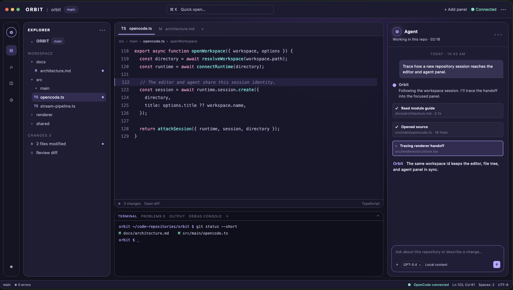

<div align="center">
  
  <h1>Orbit</h1>
  <p><strong>Agent Development Environment</strong></p>
  <p>Your repository, editor, terminal, agent, and change review—together on one desktop.</p>
</div>

<p align="center">
  
</p>

Orbit is an open-source coding workbench built around the repository you open. Work directly in its files, bring an agent into the same workspace, and follow the work from the first prompt to the diff.

## One workspace for the whole coding loop

- **Explore and edit.** Browse the project, work in the Monaco editor with tabs and autosave, and open a single file or a full repository.
- **Work with an agent.** Use the built-in OpenCode panel to follow streamed responses, reasoning, tool activity, todos, and permission requests. Choose from the models and agents available through OpenCode, attach files, reference workspace files with `@`, and queue or steer follow-ups.
- **Run the project.** Use Orbit’s integrated terminal from the active workspace, or switch an agent panel to the OpenCode TUI.
- **Review the change.** Orbit surfaces workspace file changes it observes. When it knows a file’s starting content, open a Monaco diff; when it does not, the file stays marked as observed rather than showing a guessed diff. Changes are observed, not attributed to a particular tool or person.

## Agent Mode

Spread out when a task benefits from parallel work. Agent Mode arranges up to eight concurrent session panels in a resizable workspace. Each panel keeps its own session and workspace context, so you can move between agent work without losing your place in the code.

## OpenCode V2

OpenCode V2 is the only runtime enabled in Orbit today. Orbit connects to a compatible OpenCode service or starts one through the `opencode` CLI; its available models and agents come from that runtime. DeepSeek Harness code remains in the repository as dormant source and is not selectable in the app. Other runtimes are not available yet.

## Orbit Mobile

Pair the optional Orbit Mobile companion from **Settings → Mobile Setup**. Keep Orbit Desktop open while using the phone; when the companion server is connected to the shared OpenCode service, both can access the same sessions. See [Connecting Orbit Mobile](docs/operations.md#connecting-orbit-mobile).

## Get started

### Requirements

- Node 22.23.2 or later within the Node 22 release line
- OpenCode V2 on your `PATH`, or a compatible OpenCode service already running
- macOS for the most complete and validated experience; development launch is also supported on Linux and Windows

### Run from source

```sh
npm install
npm run dev
```

Open a folder from Orbit to create a workspace session. Orbit discovers a compatible OpenCode service or starts one using the installed CLI.

### Build and install

```sh
npm run build          # compile and launch
npm run build:compile  # compile only
npm start              # launch the existing build
npm run pack           # package Orbit.app on macOS
npm run install-app    # build, package, and install to /Applications (macOS)
```

## Contributing

```sh
npm test
npm run check
```

`npm run check` runs TypeScript checks, the Vitest suite, documentation validation, and a production compile. macOS is the primary GUI validation target; Linux and Windows also receive launcher and terminal smoke coverage.

## Project docs

[Architecture](docs/architecture.md) · [Walkthrough](docs/walkthrough.md) · [Events](docs/events.md) · [Main process](docs/main.md) · [Preload bridge](docs/preload.md) · [Renderer](docs/renderer.md) · [Shared types](docs/shared.md) · [Operations](docs/operations.md)
